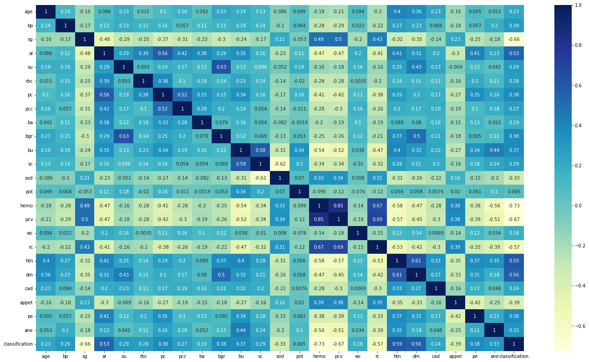
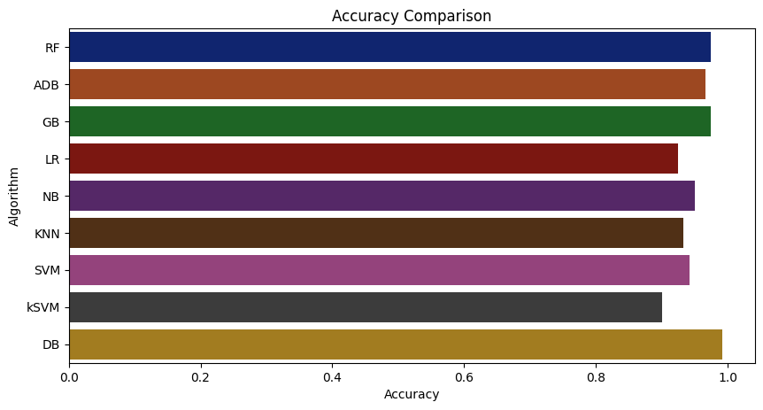
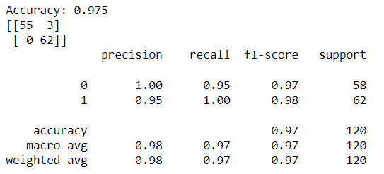

# Chronic-Kidney-Disease-Prediction
The goal of this project is predit the chronic kidney disease using parameters such as Specific Gravity, Hyper Tension, Hemoglobin, Diabetes Mellitus, Albumin
, Appetite, Red Blood Cell Count, Pus Cell etc.

## Description
## Domain : Healthcare
## Technology:- Machine Learning and Web Development
## Languages:- python, html, css and javascript
## Framework:- Flask 
## Libraries used:-
1. Numpy
2. Matplotlib
3. Seaborn
4. Sklearn
5. Pandas
## 1. Dataset:- Kidney_data.csv
This is open source data set taken from kaggle.  

Attributes in given data set:-

age - age

bp - blood pressure

sg - specific gravity

al - albumin

su - sugar

rbc - red blood cells

pc - pus cell

pcc - pus cell clumps

ba - bacteria

bgr - blood glucose random

bu - blood urea

sc - serum creatinine

sod - sodium

pot - potassium

hemo - hemoglobin

pcv - packed cell volume

wc - white blood cell count

rc - red blood cell count

htn - hypertension

dm - diabetes mellitus

cad - coronary artery disease

appet - appetite

pe - pedal edema

ane - anemia

class - class

**Attribute Information:**

We use 24 + class = 25 ( 11 numeric ,14 nominal)

Age(numerical) age in years

Blood Pressure(numerical) bp in mm/Hg

Specific Gravity(nominal) sg - (1.005,1.010,1.015,1.020,1.025)

Albumin(nominal) al - (0,1,2,3,4,5)

Sugar(nominal) su - (0,1,2,3,4,5)

Red Blood Cells(nominal) rbc - (normal,abnormal)

Pus Cell (nominal) pc - (normal,abnormal)

Pus Cell clumps(nominal) pcc - (present,notpresent)

Bacteria(nominal) ba - (present,notpresent)

Blood Glucose Random(numerical) bgr in mgs/dl

Blood Urea(numerical) bu in mgs/dl

Serum Creatinine(numerical) sc in mgs/dl

Sodium(numerical) sod in mEq/L

Potassium(numerical) pot in mEq/L

Hemoglobin(numerical) hemo in gms

Packed Cell Volume(numerical)

White Blood Cell Count(numerical) wc in cells/cumm

Red Blood Cell Count(numerical) rc in millions/cmm

Hypertension(nominal) htn - (yes,no)

Diabetes Mellitus(nominal) dm - (yes,no)

Coronary Artery Disease(nominal) cad - (yes,no)

Appetite(nominal) appet - (good,poor)

Pedal Edema(nominal) pe - (yes,no)

Anemia(nominal) ane - (yes,no)

Class (nominal) class - (ckd,notckd)

## 2. Data Cleaning
Steps followed during data cleaning:-
1. Replace categorical values into numerical values.
2. Correct the mis-spelled categorical values.
3. Drop the null values.
## 3. Exploratory Data Analysis
Steps followed in EDA:-
1. Find out correlation in data set

2. Remove correlated values and only 8 features from data set are taken
## 4. Spilt the 80 % data for training and 20% data for testing
 

## 5. Creation of machine learning model

## Machine Learning models are created by following Algorithms
1. Random Forest Algorithm
2. AdaBoostClassifier
3. GradientBoosting
4. Logistic Regression
5. Naive Bayes
6. KNN
7. Kernal SVM
8. Decision Tree

We have taken the Random forest algorithm model because of it's accuracy.

## 6. Hyperparameter tunning
Perform the hyperparameter tuning to avoid the overfitting in model.
### We got 97.5% accuracy 

## 7. Deploy model on website
Create website using flask and use model for prediction.

